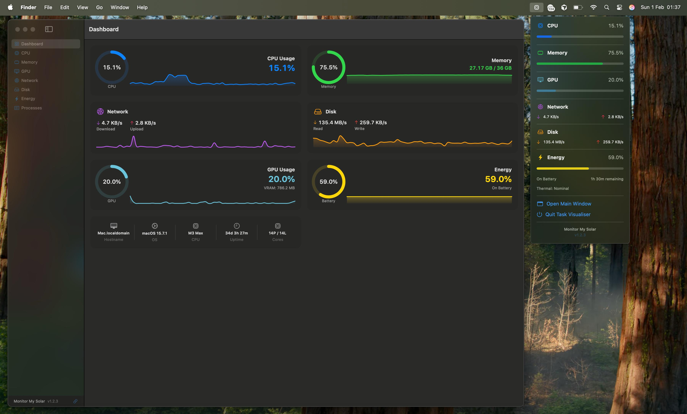
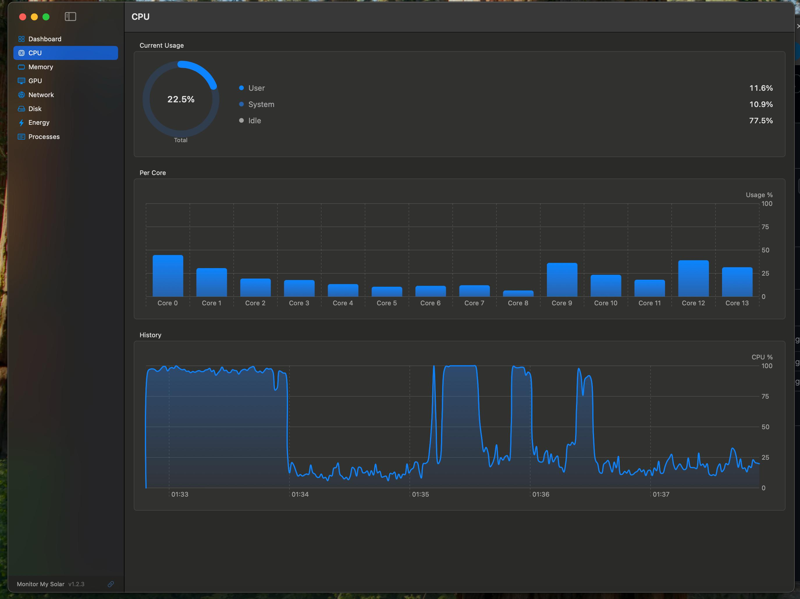
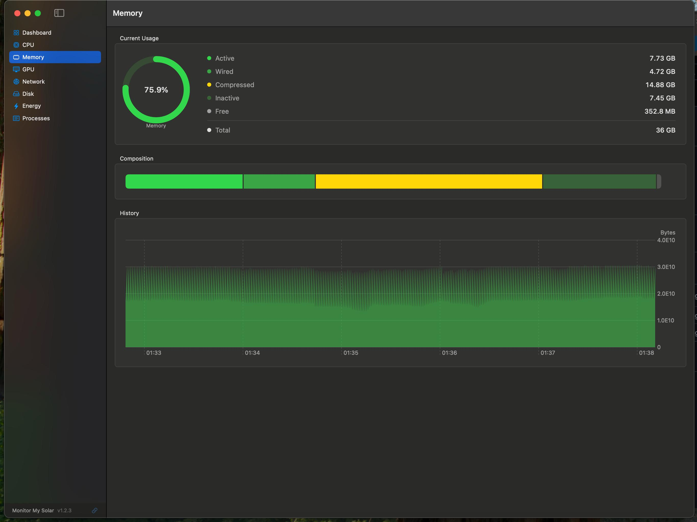
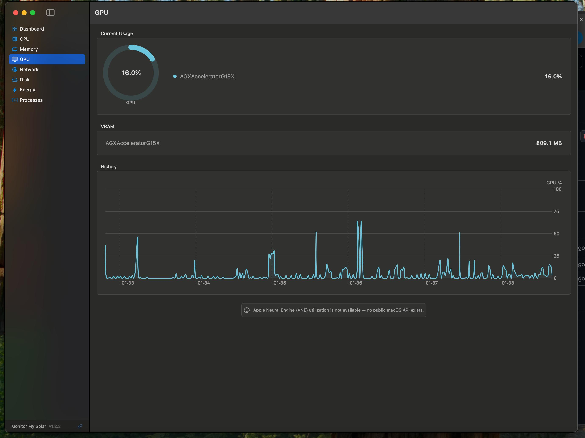
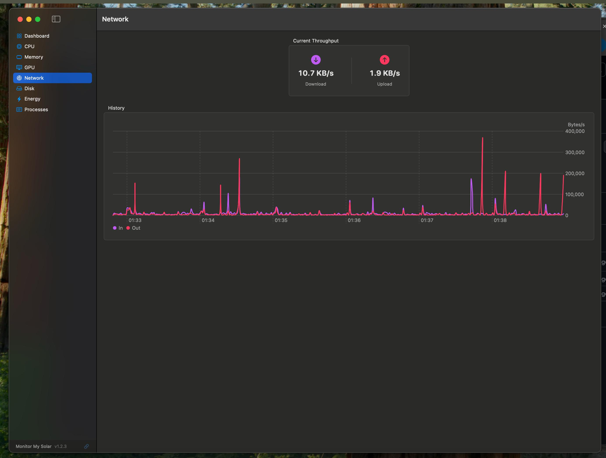
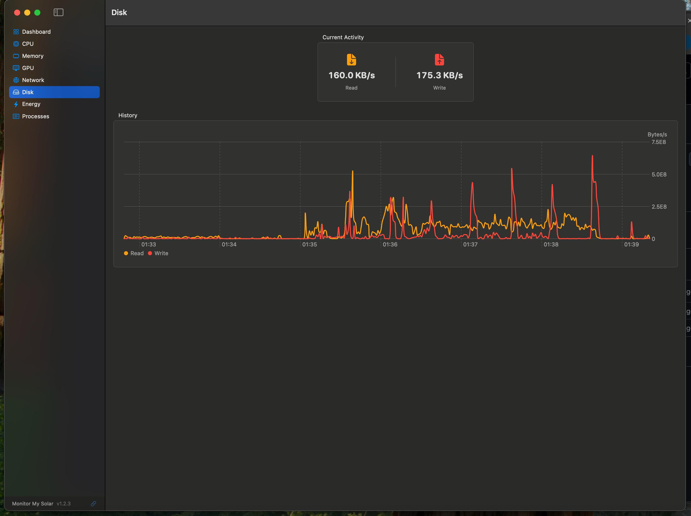

# Task Visualiser

A native macOS system monitor with a menu bar widget. Track CPU, Memory, GPU, Network, Disk, and Energy usage in real time.

Built with SwiftUI. Supports Apple Silicon and Intel Macs.

## Screenshots

### Dashboard & Menu Bar

### CPU

### Memory

### GPU

### Network

### Disk

## Features

- **Dashboard** — at-a-glance overview of all system metrics
- **CPU** — total usage, per-core breakdown, and history chart
- **Memory** — active/wired/compressed/inactive breakdown with composition bar and history
- **GPU** — utilisation, VRAM usage, and history chart
- **Network** — live download/upload throughput with history
- **Disk** — read/write activity with history
- **Energy** — battery level and thermal state
- **Menu bar widget** — always-visible summary without opening the app
- **Auto-updater** — checks GitHub releases for new versions

## Requirements

- macOS 14.0+
- Xcode 15+

## License

See [LICENSE](LICENSE) for details.
